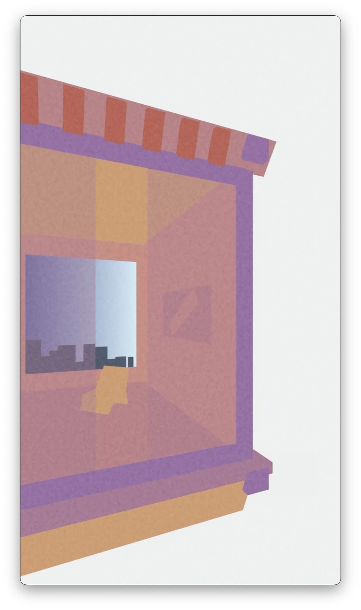
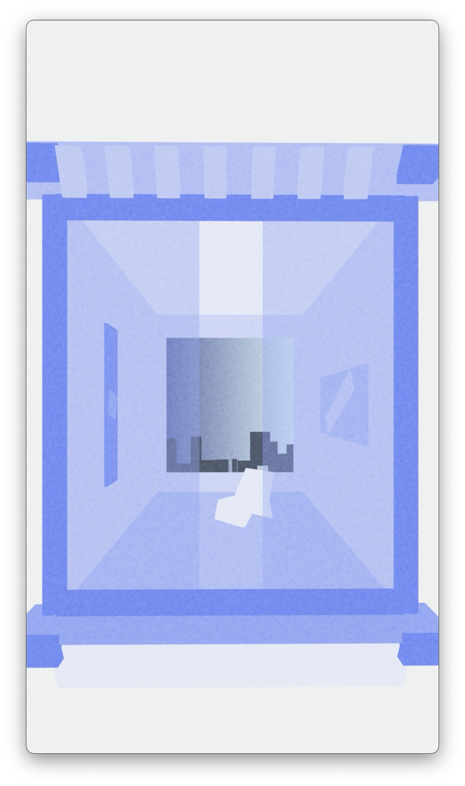
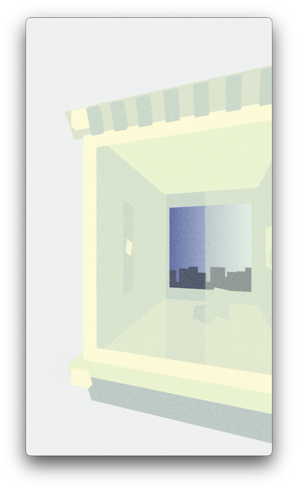

# Edward Hopper Algorithic Art

## Overview
The artwork of [Edward Hopper](https://en.wikipedia.org/wiki/Edward_Hopper) and the old architecture of Pennsylvania with ornate windows inspired my [algorithmic art](https://en.wikipedia.org/wiki/Algorithmic_art) (algo art) project. My objective was to create a 3D animation via the Three.js library that converys depth and space similar to rooms dispicted in Hopper's paintings. Additionally, I made the Javascript code such that [traits of the windows](https://www.windowsonlineuk.co.uk/blog/what-are-the-different-parts-of-a-window/) window opening size, stool, casing, sash, sill and lintels) could be modified.

<b>You can view the animation in your own browser by following [this link]()!</b>

## Visual Description 
My animation emphasizes a [parallax effect](https://en.wikipedia.org/wiki/Parallax) by pivoting the viewer's point of view to the left and right the to draw attention to the depth of the scene. The window in the foreground has translucent curtains that with a gap in the middle that as a gentle boundary between the viewer's exterior point of view despite the openness of the interior space.I incorporated a distant environment in the background to compound the effect of spaciousness.

## Conceptual Inspiration
I am a fan of Edward Hopper's work and as pointed out by other admirers of his work, Hopper incorporates windows into his paintings. These windows tend to be large and reveal a spacious interior. As one looks through the depicted window in the foreground, sometimes another window is vissble in the background that frames the space beyond the interior.

<table>
  <tr>
    <td align="center">
       
      Office in a Small City. Edward Hopper. 1953.
    </td>
    <td align="center">
       
      Apartment Houses. Edward Hopper. 1923.
    </td>
    <td align="center">
       
      Cape Cod Morning. Edward Hopper. 1950.
    </td>
  </tr>
</table>
<table>
  <tr>
    <td align="center">
       
      Single Frame of Hopper Demo 2 Algo Art. Morris Aguilar. 2023.
    </td>
    <td align="center">
       
      Single Frame of Hopper 18 Algo Art. Morris Aguilar. 2023.
    </td>
    <td align="center">
       
      Single Frame of Hopper 15 Algo Art. Morris Aguilar. 2023.
    </td>
  </tr>
</table>

## Technical Overview
I made the this project can run directly on any web browser, making it accessible and easy to share. I used the Three.js library to create the 3D environment that would run in a browser. 

# Contact
Morris A. Aguilar, Ph.D. 
@morrisglr.bsky.social