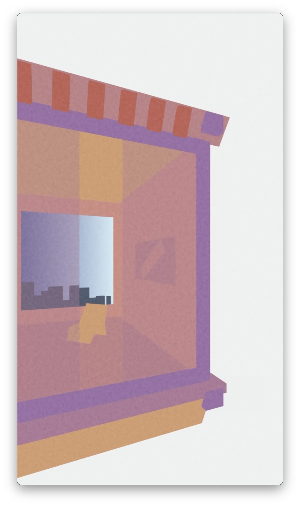
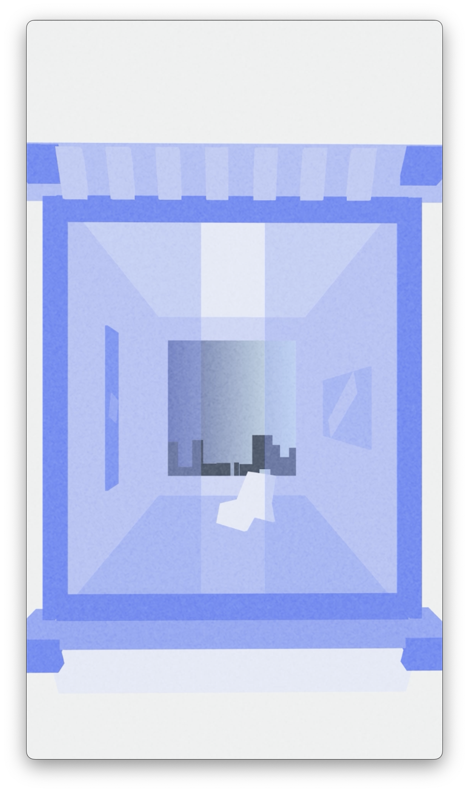
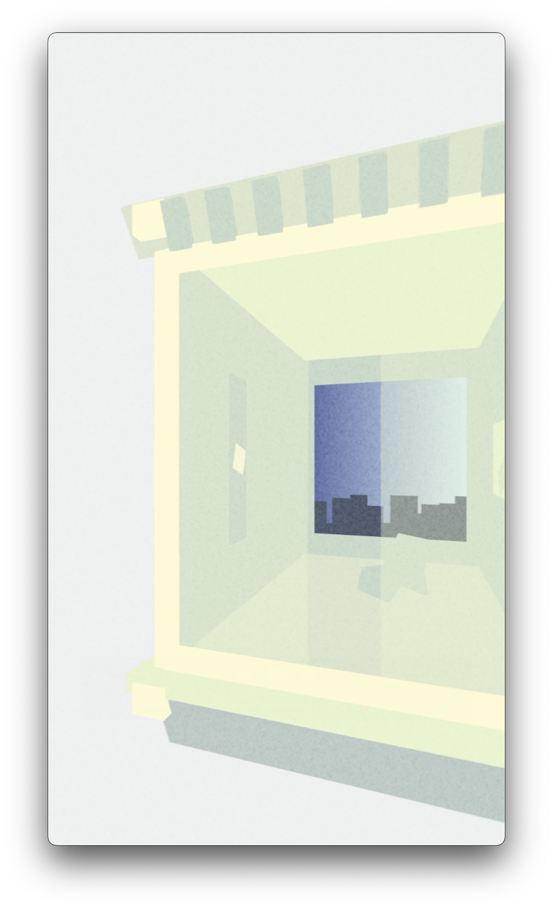

<video src="https://github.com/user-attachments/assets/2ba5c9f2-d9b3-43ec-abf0-23a55bf8a67d" autoplay loop muted playsinline width="320"></video>


# Hopper Window

> I reverse-engineer painters' compositional logic into parametric 3D code. Hopper's windows are not incidental — they are the subject: a frame within a frame, depth rendered as emotional distance.

**[→ Live demo](https://morrisglr.github.io/algo-art-hopper/)**

---

## Controls

| Key | Action |
|-----|--------|
| `R` | New composition (new seed) |
| `C` | Export video (WebM via CCapture.js) |
| `#seed=N` in URL | Reproduce a specific composition |

Move the mouse (or touch) to add a ±5° parallax offset on top of the autonomous pendular swing.

---

## Concept

Edward Hopper's paintings are built around windows — not as decoration but as compositional devices. A window in the foreground frames an interior; another window in the background frames the city beyond. The viewer is always outside, always peering in. That spatial logic — frame within frame, depth as emotional distance — is what this piece formalizes into code.

Every load produces a unique composition: a seeded PRNG selects one of four Hopper-derived color palettes (`nighthawks`, `morning_sun`, `room_brooklyn`, `sun_empty_room`), randomizes curtain opacity and gap width, and generates a new cityscape silhouette. Same seed → identical result.

---

## Conceptual Inspiration

<table>
  <tr>
    <td align="center">
      <br/>
      <sub>Office in a Small City. Edward Hopper. 1953.</sub>
    </td>
    <td align="center">
      <br/>
      <sub>Apartment Houses. Edward Hopper. 1923.</sub>
    </td>
    <td align="center">
      <br/>
      <sub>Cape Cod Morning. Edward Hopper. 1950.</sub>
    </td>
  </tr>
</table>

<table>
  <tr>
    <td align="center">
      <br/>
      <sub>Single Frame of Hopper Demo 2 Algo Art. Morris Aguilar. 2023.</sub>
    </td>
    <td align="center">
      <br/>
      <sub>Single Frame of Hopper 18 Algo Art. Morris Aguilar. 2023.</sub>
    </td>
    <td align="center">
      <br/>
      <sub>Single Frame of Hopper 15 Algo Art. Morris Aguilar. 2023.</sub>
    </td>
  </tr>
</table>

---

## Technical Overview

- **Three.js r120** — WebGL scene with four z-depth zones: window frame, room interior, city silhouette, GLSL sky gradient
- **Zero build system** — pure vanilla JS loaded via `<script>` tags; runs directly in any browser
- **Portrait canvas** — 1080×1920 (9:16), scaled via CSS; deliberate formal choice mapping to vertical display formats
- **Parametric chain** — all dimensions derive from `scaleFactor` and `chosenAspectRatio`; no magic numbers
- **Seeded PRNG** — `mulberry32` ensures reproducibility; seed in URL hash, displayed on canvas

Part of the **Computational Art History** series — each entry translates a painter's compositional logic into a generative parametric system.

---

## Run Locally

```bash
git clone https://github.com/MorrisGlr/algo-art-hopper.git
cd algo-art-hopper
python3 -m http.server 8000
# open http://localhost:8000
```

No install step. No build step.

---

## License

[MIT](LICENSE) — Morris Aguilar, 2026

[@morrisglr.bsky.social](https://bsky.app/profile/morrisglr.bsky.social) · [Creative Portfolio](https://morrisglr.github.io/creative)
